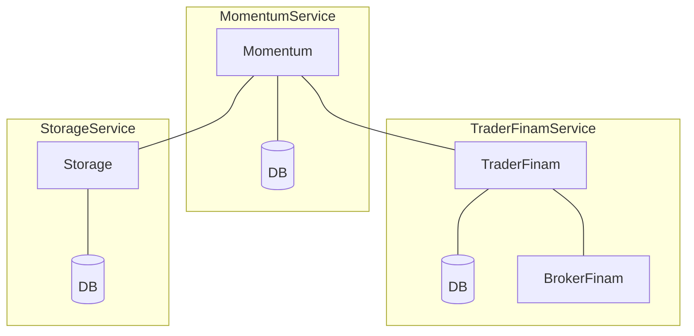

```mermaid
graph TD
  subgraph MomentumService
    Momentum
    MomentumDatabase[(DB)]
  end

  subgraph TraderFinamService
    TraderFinam
    TraderFinamDatabase[(DB)]
    BrokerFinam
  end

  subgraph StorageService
    Storage
    StorageDatabase[(DB)]
  end

    Momentum---TraderFinam
    Momentum---Storage
    Momentum---MomentumDatabase[(DB)]
    Storage---StorageDatabase[(DB)]
    TraderFinam---TraderFinamDatabase[(DB)]
    TraderFinam---BrokerFinam
```
